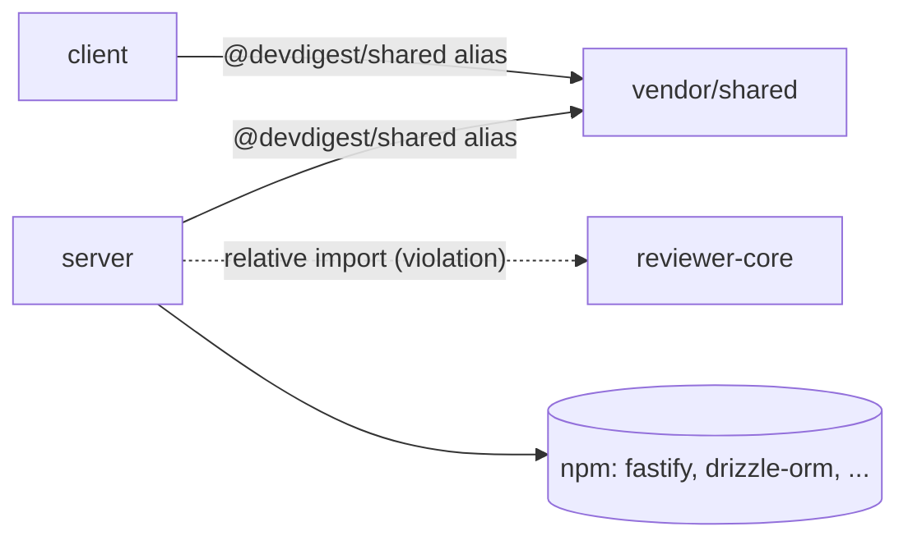

# Dependency checker

## When to use

Use this skill when the user asks to check, audit, or analyze the repo's
dependencies: what is installed, how big it is, what is unused or duplicated,
and how the packages depend on each other.

This repo is **not a monorepo**. `client/`, `server/`, `reviewer-core/` and
`e2e/` are standalone packages, each with its own `package.json` and lockfile.
There is no workspace tool: never claim `workspace:*` links, pnpm workspaces,
turborepo or nx. Code is shared through **tsconfig `paths` aliases**
(`@devdigest/shared`, `@devdigest/reviewer-core`, `@devdigest/ui`) pointing at
`src/vendor/*`, or occasionally by relative path.

## Read-only, always

Gather data with Read, Grep, Glob and read-only Bash (`du -sh`, `ls`). Never
run `pnpm remove`, `pnpm install`, `npm uninstall` or edit any `package.json`
or lockfile. Every removal or upgrade is a **recommendation for the user to
confirm** — phrase it as "recommend removing X (confirm first)", never "I
removed X".

## Procedure

1. **Scope.** Read each package's `package.json` (`dependencies`,
   `devDependencies`). Record which of `client/`, `server/`, `reviewer-core/`,
   `e2e/` you analyzed and which you skipped (and why).
2. **Sizes.** `du -sh <pkg>/node_modules/<dep>` for the heaviest dependencies
   (or use sizes the user already supplied). If `node_modules` is absent, say
   sizes are unavailable rather than guessing.
3. **Internal vs external.** Classify every dependency edge:
   - **External** — an npm package declared in `package.json`.
   - **Internal** — a tsconfig-alias import (`@devdigest/*`, `@shared/*`) or a
     relative path that crosses a package boundary (`../../reviewer-core/...`).
     Internal edges are not in any `package.json`; find them with Grep over
     `src/` and the `paths` block of each `tsconfig.json`.
4. **Unused.** For each declared dependency, Grep `src/` (and config files) for
   an import of it. Declared but never imported = candidate unused. Note
   dependencies loaded only by tooling config (e.g. a plugin named in a config
   file) before calling them unused.
5. **Drift.** Compare versions of the same package across the four
   `package.json` files. Different resolved versions of one package are drift.
6. **Boundary check.** A relative import that reaches into another package's
   `src/` (for example `../../reviewer-core/src/pipeline.js`) bypasses that
   package's public entry point and the alias contract. Flag it.

## Report format

Produce the report with exactly these sections, in this order.

### 1. Scope

List the packages analyzed (client, server, reviewer-core, e2e), the data
sources used, and any limits (missing `node_modules`, skipped package).

### 2. Dependency graph

A fenced Mermaid `flowchart` of how the packages relate. Draw internal edges
(alias / relative imports) between packages and group external npm packages
separately. Label each internal edge with its mechanism.

````

````

Use a dotted edge for a boundary violation.

### 3. Size breakdown

A table, heaviest first. Never a vague "some packages are large".

| Package | Dependency | Version | Installed size | Notes |
|---|---|---|---|---|
| client | next | 15.0.3 | 132M | framework, expected |

### 4. Findings & Priorities

Group every finding under one of these tiers. Never leave findings unranked.

- **P0** — breaks the architecture or is a correctness/security risk: a deep
  relative import into another package's `src/` bypassing its entry point;
  a dependency with a known critical issue.
- **P1** — real cost, fix soon: version drift of the same package across
  packages; a declared-but-unimported dependency that is heavy (large installed
  size) or runtime-critical to remove.
- **P2** — hygiene: small unused dependencies, devDependency placed under
  `dependencies`, avoidable duplicates.
- **Info** — observations needing no action: large but justified frameworks,
  expected overlap such as `typescript`/`vitest` in every package.

**Every finding names a concrete package, dependency, or file** (for example
`server/package.json`, `moment`, `server/src/services/review-service.ts`) and
gives a specific recommendation. Generic advice such as "consider optimizing
dependencies" is not a finding. State each removal as a recommendation for the
user to confirm.

### 5. Summary

3 to 5 takeaways, ordered by priority (P0 first), each one actionable and
naming its target. End the report here.

## Common mistakes

- Treating a tsconfig alias or relative cross-package import as an npm
  dependency, or an npm dependency as an internal one.
- Saying the repo uses pnpm workspaces or `workspace:*`.
- Ranking drift or an unused dependency as P0 — P0 is for boundary and
  correctness breaks.
- Reporting "unused" from `package.json` alone without Grepping imports.
- Executing a removal instead of recommending it.
