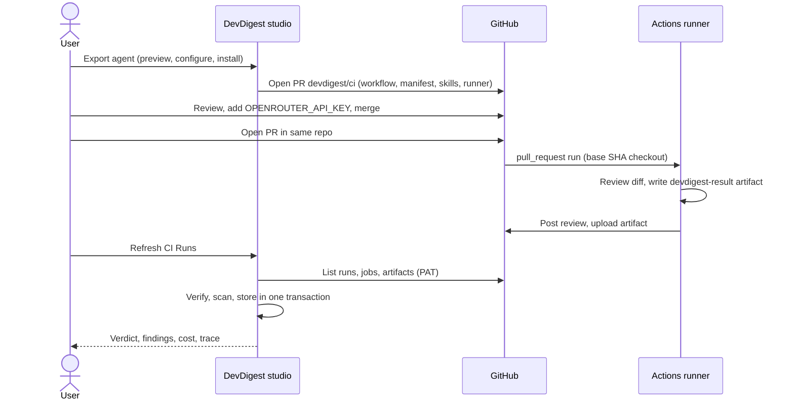

# Export an agent to GitHub Actions

Run one of your DevDigest review agents on every pull request in a GitHub
repository, as a normal CI check. DevDigest generates a workflow plus the
agent's manifest, skills and a bundled runner, and opens a single pull request
(`devdigest/ci`) that adds them. After it is merged, each PR runs the agent and
the results show up on the studio's **CI Runs** page.

Specs: [`server/specs/ci.md`](../server/specs/ci.md) and
[`client/specs/agent-ci.md`](../client/specs/agent-ci.md).

## Prerequisites

- The repository is imported in DevDigest.
- The GitHub token saved in **Settings** (the PAT) can write to the repo:
  - classic PAT: `repo` and `workflow` scopes;
  - fine-grained PAT: Contents, Pull requests and Workflows (write), Actions
    (read). Actions read is also what lets DevDigest pull results back.
- An OpenRouter API key you can add as a repository secret.

If the PAT lacks the `workflow` scope the export fails with
`pat_workflow_scope`. Other export errors: `github_repo_not_found` (token cannot
see the repo) and `github_forbidden`.

## Steps

1. **Export.** Open the agent, go to the **CI** tab and start the Export wizard.
   Pick the target (only GitHub Actions is available; CircleCI, Jenkins and
   Generic CLI are shown as "Coming soon"), review the generated workflow on the
   Preview step (you can edit it; edits are linted server-side), choose triggers
   and options on Configure, then install via PR or download the zip.
2. **Review the PR.** Before merging, check the workflow for the triggers it
   listens to (only `pull_request`), its permissions (`contents: read`,
   `pull-requests: write`) and the secrets it uses.
3. **Add the secret.** In the target repo go to Settings, Secrets and variables,
   Actions, and add `OPENROUTER_API_KEY`.
4. **Merge** the `devdigest/ci` PR. The PR's own check shows as skipped: the
   runner is not on the base branch yet (bootstrap guard), which is expected.
5. **Open a test PR in the same repository** (not a fork first). Fork PRs are
   skipped by design.
6. **Gate merges.** On the CI tab set **Fail CI on: Critical** (the choice is
   baked into the exported manifest, so the installation shows an out-of-date
   badge when it changes; re-export to update). Then mark the check as required
   in branch protection or a repository ruleset.
7. **Refresh CI Runs.** Open the CI Runs page and press Refresh. This syncs
   finished workflow runs from GitHub into the studio; the page also refreshes
   automatically.

## Security model

- Triggers: only `pull_request`. `pull_request_target` is never generated and
  the lint rejects it.
- The workflow checks out the PR base SHA with `persist-credentials: false`, so
  the code that runs (`.devdigest/runner.mjs`, the manifest) comes from the
  protected base branch, not from the PR author.
- Fork PRs are skipped: each job has a fork guard, so secrets are never exposed
  to forks.
- Permissions are limited to `contents: read` and `pull-requests: write`;
  third-party actions are pinned by commit SHA; PR-controlled values reach the
  runner only through `env`, never interpolated into shell.
- Ingest is verified: DevDigest pulls results with your PAT and checks the head
  SHA, repository id, PR, workflow path, agent slug and run id, bounds and
  strictly validates the artifact, and scans it for secrets before storing.
- Recommended: add a `CODEOWNERS` entry for `.github/workflows/` and
  `.devdigest/` so changes to the workflow, manifests and runner need review
  from the right people.

## How it fits together

Ingest is idempotent: refreshing again does not duplicate runs.

## Troubleshooting

- Run missing on CI Runs: press Refresh; check the workflow ran on a same-repo
  PR and that the PAT has Actions read.
- Run recorded as `artifact_missing`: the runner was absent in the base
  checkout (the export PR itself) or the job failed before writing a result.
- "Out of date" badge: the agent changed since export; re-export.
