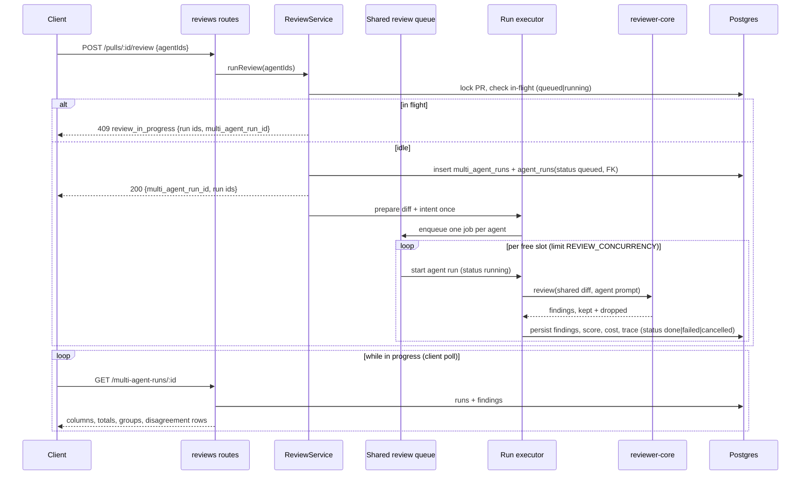

# Spec: Multi-Agent Review & live statuses

Spec ID: SPEC-10
Status: draft
Supersedes: none

Client-side counterpart (Configure run screen, PR page agent picker, results
page in Columns / Tabs modes, "Where agents disagree" block, per-agent trace
drawer): [`../../client/specs/multi-agent-review.md`](../../client/specs/multi-agent-review.md).
That spec's acceptance criteria are referenced below as `C-AC-N`; this spec
does not restate them.

Related: [`pr-triage-queue.md`](./pr-triage-queue.md) (SPEC-05) — its bulk
"Review all" and single-PR 409 `review_in_progress` behavior are preserved,
but its runs now go through the shared queue defined here (see Module
interactions).

## Changelog

- 2026-10-10 — post-validation amendment (user-approved). Live validation on
  PR #484 (Measurements, "Live validation notes") showed two findings about the
  same `email` removal left unlinked: their categories differ and their title
  Jaccard was ≈0.27, below 0.3, so the disagreement block wrongly showed General
  as "did not flag". AC-25: the title test is now the overlap coefficient
  |A∩B| / min(|A|,|B|) ≥ 0.5, replacing Jaccard ≥ 0.3; the location condition
  and the "same category OR similarity" structure are unchanged. AC-26: an
  empty token set on either side gives similarity 0. AC-28: union-find order
  now sorts by highest overlap coefficient first. AC-33: outcome unchanged
  (0.20, still separate), value stated. Added AC-48: the #484 pair as a second
  worked example (≈0.67, linked). AC-27/AC-29 same-agent rules unchanged.
- 2026-10-10 — resolved every open question with the user and confirmed all
  assumed defaults (AC-4, AC-10, AC-24, AC-42 now confirmed). AC-28/AC-29
  rewritten: a merge that would put two findings of the same agent in one group
  is rejected, using a deterministic edge order. AC-33 notes the
  Customer-Facing agent exists only in the unit-test fixture. AC-35/AC-39
  rewritten: every group is a row; coverage gaps among completed agents are
  conflicts. Added AC-45/AC-46 ("Cancel all" for a multi-run) and AC-47 (queue
  limit in the estimates response). The bulk-limiter nesting question became a
  behavioral constraint (Edge cases, "Nested limiters"); how to meet it is left
  to the planner.
- 2026-10-10 — initial version

## Problem and user

One pull request can carry a security risk, a performance problem and a
domain-rule violation at the same time. A single general-purpose reviewer
covers all three shallowly; several specialised reviewers cover them better —
but only if the product removes duplicates, shows where reviewers disagree,
and does not hide what the extra coverage cost.

Today the server cannot do this. `POST /pulls/:id/review` accepts one
`agentId` or `all`, never a chosen set. Agents for one PR run **sequentially**
inside `ReviewRunExecutor.executeRuns`, so N agents take the sum of their
durations. The `multi_agent_runs` table exists but is unused and nothing links
an `agent_run` to it, so there is no parent "this was one multi-agent review"
record. No code groups overlapping findings across agents or computes which
agents disagree about a location. The grounding gate's decision is persisted
only as a `k/n passed` string, so a trace cannot explain *which* findings were
dropped and why.

The user is a reviewer who opens a PR (e.g. seed PR #482 "Add rate limiting to
public API endpoints"), picks three specialised agents, and wants to watch each
one's status, then compare their findings without losing who said what.

## Goals / Non-goals

**Goals**

- Run a user-chosen set of agents on one PR as one **multi-agent run**: a
  parent `multi_agent_runs` row with every child `agent_run` linked to it.
- Execute agents **in parallel**, bounded by one **server-wide shared queue**
  (limit `REVIEW_CONCURRENCY`, default 3) that every agent run in the server
  goes through; excess runs are visibly `queued` with a queue position.
- Prepare the diff and intent **once** per multi-run and share them across its
  agents; one agent's failure never cancels or discards the others.
- A read endpoint for a multi-run's results: per-agent columns with live
  status, totals, finding groups and disagreement rows.
- A deterministic, unit-tested grouping heuristic that merges similar findings
  across agents for display **without** losing any original finding or its
  attribution.
- A trace per agent run that explains tokens, cost and the grounding gate
  decision, including the dropped findings and their reasons.
- Per-agent time/cost estimates from past runs, for the Configure run screen.

**Non-goals**

- No change to `agent-runner/` or `server/src/modules/ci/` (worktree
  boundary). CI runs do not go through the shared queue.
- Eval suite runs (agent and skill evals) are not moved onto the shared queue
  by this spec.
- No persisted groups or conflicts — both are computed on read.
- No LLM-based de-duplication or "judge" agent. Grouping is deterministic.
- No reason text for "did not flag" — agents do not emit one, and none is
  invented.
- No "Learn" behavior.
- No new seed agents; the demo uses existing seed agents.
- No retry of a failed agent inside an existing multi-run; re-running starts a
  new multi-run.
- No predictive (diff-size-based) estimate — estimates are historical only.

## Acceptance criteria (EARS)

**Starting a multi-agent run**

- AC-1: WHEN `POST /pulls/:id/review` is called with a body containing
  `agentIds`, the server shall create one `multi_agent_runs` row for that PR and
  one `agent_run` per distinct agent id, each linked to that parent, and
  respond with the parent's `multi_agent_run_id` and the child run ids.
  (verify via: integration test)
- AC-2: WHEN `agentIds` contains duplicate ids, the server shall de-duplicate
  them and create exactly one `agent_run` per distinct agent. (verify via:
  integration test)
- AC-3: IF `agentIds` is empty, or any id does not exist in the caller's
  workspace, or any id refers to a disabled agent, THEN the server shall respond
  400 and create no `multi_agent_runs` row and no `agent_run`. (verify via:
  integration test)
- AC-4: IF a body contains `agentIds` together with `agentId` or `all`, THEN
  the server shall respond 400 and create nothing.
  (verify via: integration test)
- AC-5: WHEN `agentIds` contains exactly one agent, the server shall still
  create a parent multi-run, so a "1 agent vs 3 agents" comparison goes through
  the same code path. (verify via: integration test)
- AC-6: WHEN `POST /pulls/:id/review` is called with `agentId` or `all` and no
  `agentIds`, the server shall behave as before this spec — no parent
  multi-run, same response shape. (verify via: integration test)
- AC-7: IF a multi-run is requested while the PR has any `agent_run` in
  `queued` or `running` state, THEN the server shall respond 409
  `review_in_progress`, create nothing, and include in the error details the
  in-flight run ids and, when they belong to one, the in-flight
  `multi_agent_run_id`. (verify via: integration test)
- AC-8: WHEN a multi-run is accepted, the response shall return as soon as the
  parent and child rows exist, without waiting for any agent to finish.
  (verify via: integration test)

**Shared queue and execution**

- AC-9: WHILE agent runs are executing anywhere in the server — multi-runs,
  single-PR reviews and bulk "Review all" alike — no more than
  `REVIEW_CONCURRENCY` agent runs shall be in `running` state at once. (verify
  via: integration test)
- AC-10: WHERE `REVIEW_CONCURRENCY` is unset, the limit shall be 3. IF it is
  set to a value that is not a positive integer, THEN the server shall use 3
  and log a warning. (verify via: unit test)
- AC-11: WHEN an agent run is created and no queue slot is free, its status
  shall be `queued`, and it shall move to `running` when a slot frees, in
  first-in-first-out order of enqueueing. (verify via: integration test)
- AC-12: WHILE an agent run is `queued`, every read that reports its status
  (multi-run results, PR active runs) shall also report its 1-based queue
  position, where position 1 means it starts next. (verify via: integration
  test)
- AC-13: WHEN a multi-run's agents fit within free queue slots, they shall run
  concurrently, not sequentially. (verify via: integration test)
- AC-14: WHEN a multi-run starts executing, the PR diff and intent shall be
  loaded once and the same prepared input shall be given to every agent of
  that multi-run. (verify via: integration test)
- AC-15: IF one agent run of a multi-run fails or is cancelled, THEN every
  other agent run of the same multi-run shall continue, and its findings, score
  and trace shall be persisted exactly as if it had run alone. (verify via:
  integration test)
- AC-16: IF the shared diff/intent preparation for a multi-run fails, THEN
  every agent run of that multi-run shall be marked `failed` with the same
  reason, and no agent run of any other PR shall be affected. (verify via:
  integration test)
- AC-17: WHEN `POST /runs/:id/cancel` is called on a `queued` run, the run
  shall become `cancelled` immediately, leave the queue, and never make an LLM
  call. (verify via: integration test)
- AC-18: WHEN the server boots, every `agent_run` left in `queued` or `running`
  state by a previous process shall be marked `failed` with a reason stating
  the server restarted. (verify via: integration test)

**Results read**

- AC-19: WHEN `GET /multi-agent-runs/:id` is requested for a multi-run in the
  caller's workspace, the server shall return the PR identity (id, number,
  title, repo id), the run timestamp, and one column per selected agent, in the
  order the agents were selected. (verify via: integration test)
- AC-20: WHEN a column is returned, it shall carry the agent's id and name, its
  run id, status (`queued` | `running` | `done` | `failed` | `cancelled`),
  queue position when queued, error message when failed, provider, model,
  duration, tokens in/out, cost, score, verdict, summary and its findings.
  Fields not yet known shall be null, never zero. (verify via: integration
  test)
- AC-21: WHEN the multi-run totals are returned, total cost shall be the sum
  of the recorded costs of its agent runs and total duration shall be the
  wall-clock span from the multi-run's creation to the last agent's
  completion; IF no agent has a recorded cost, THEN total cost shall be null,
  not 0. (verify via: unit test)
- AC-22: WHILE any agent of the multi-run is `queued` or `running`, the
  response shall mark the multi-run as in progress, and its totals as partial.
  (verify via: integration test)
- AC-23: IF `GET /multi-agent-runs/:id` is requested for an id that does not
  exist or belongs to another workspace, THEN the server shall respond 404.
  (verify via: integration test)
- AC-24: WHEN past multi-runs are listed, the server shall return them newest
  first for the caller's workspace, optionally filtered to one PR, each with PR
  identity, run time, agent count, overall status and totals, defaulting to the
  last 10 (`GET /multi-agent-runs?pr_id=&limit=`, `limit` default 10). (verify
  via: integration test)

**Finding groups**

- AC-25: WHEN groups are computed, two findings shall be linked only if they
  are in the same file AND their line ranges overlap or are at most 3 lines
  apart AND (they share a category OR the overlap coefficient
  (Szymkiewicz–Simpson) of their normalized title token sets,
  |A∩B| / min(|A|,|B|), is ≥ 0.5). (verify via: unit test)
- AC-26: WHEN titles are normalized for that comparison, they shall be
  lower-cased, stripped of punctuation, split on whitespace, and have a fixed
  stopword list removed; IF either token set is empty, THEN the similarity
  shall be 0. (verify via: unit test)
- AC-27: WHEN two findings come from the same agent run, they shall never be
  linked directly, even if every other condition holds. (verify via: unit
  test)
- AC-28: WHEN groups are formed, linked pairs (AC-25, AC-27) shall be merged
  with union-find, processing pairs in a fixed order: highest title-token
  overlap coefficient (AC-25) first, then smallest line distance (0 when ranges
  overlap), then the pair's finding ids in ascending lexicographic order
  (smaller id first, then larger id). Every finding of the multi-run shall
  belong to exactly one group, a group of one included. (verify via: unit test)
- AC-29: IF merging a pair would put two findings from the same agent into one
  group — i.e. the two current groups share any agent — THEN that merge shall be
  rejected and both groups shall stay as they are, so every group holds at most
  one finding per agent. (verify via: unit test)
- AC-30: WHEN a group's representative is chosen, it shall be the member with
  the highest severity (critical > warning > suggestion), ties broken by highest
  confidence, then by selection order of the agent, then by finding id. (verify
  via: unit test)
- AC-31: WHEN a group is returned, it shall list every member's finding id,
  agent id and name, severity, confidence, original title, rationale,
  suggestion, file and line range — no member field shall be rewritten,
  merged or truncated. (verify via: unit test)
- AC-32: WHEN the same set of findings is grouped twice, the groups, their
  members, their representatives and their order shall be identical. (verify
  via: unit test)
- AC-33: WHEN the grouping function is run on the PR #482 fixture, Security's
  and Customer-Facing's "Retry-After header omitted on 429" at
  `src/middleware/ratelimit.ts:52` shall form one group, and Customer-Facing's
  "429 body has no machine-readable error code" at the same line shall stay
  in a separate group. The Customer-Facing agent exists only in this synthetic
  fixture; it is not a seed agent and is not part of the live demo (AC-44).
  Under the AC-25 rule, Security's "Retry-After header omitted on 429" vs
  "429 body has no machine-readable error code" shares only the token `429`:
  overlap coefficient 1 / min(5, 6) = 0.20 (tokens {retry, after, header,
  omitted, 429} vs {429, body, machine, readable, error, code}), below 0.5.
  (verify via: unit test)
- AC-48: WHEN the grouping function is run on the PR #484 fixture, General's
  "Removal of email field and renaming of created_at to createdAt changes
  response shape…" (`bug`, `src/api/users.ts:43-49`) and API Contract's
  "Removal of `email` field from user lookup response" (`security`,
  `src/api/users.ts:40-48`) shall be linked into one group: the ranges overlap,
  the categories differ, and the overlap coefficient is 4 / 6 ≈ 0.67 (shared
  {removal, email, field, response}; the shorter set is {removal, email, field,
  user, lookup, response}), at or above 0.5. (verify via: unit test)
- AC-34: WHEN a finding in a group is accepted or dismissed, the action shall
  apply to that original finding id only, never to other members of its
  group. (verify via: integration test)

**Disagreement rows**

- AC-35: WHEN disagreement rows are computed, every group shall produce one
  row, so the unfiltered block covers every location any agent flagged.
  (verify via: unit test)
- AC-36: WHEN a disagreement row is returned, it shall carry the group's file,
  start line and representative title, and exactly one take per **selected**
  agent of that multi-run — no take for any agent outside the selection.
  (verify via: unit test)
- AC-37: WHEN a take is built, its verdict shall be the agent's member
  severity if it flagged the group; `not_flagged` only if that agent's run is
  `done` and has no member in the group; `failed` or `cancelled` if the run
  ended that way; `pending` if it is `queued` or `running`. A failed,
  cancelled or pending agent shall never be reported as `not_flagged`.
  (verify via: unit test)
- AC-38: WHEN a take is built, it shall carry no generated reason text.
  (verify via: unit test)
- AC-39: WHEN a disagreement row is returned, it shall carry an `is_conflict`
  flag that is true IF at least one selected agent whose run is `done` did not
  flag it, OR the severities of the agents that flagged it differ; and false
  only when every `done` selected agent flagged it with the same severity.
  Agents that are `pending`, `failed` or `cancelled` shall count neither as
  flagging nor as "did not flag". The client's "Show only conflicts" filter
  (C-AC-42) uses this flag without recomputing it. (verify via: unit test)

**Trace and grounding**

- AC-40: WHEN an agent run finishes — done, failed or cancelled after the
  model responded — its trace shall record tokens in/out, cost, model, and the
  grounding gate's result: kept count, total count, and for every dropped
  finding its title, file, line range and drop reason. (verify via:
  integration test)
- AC-41: WHEN a trace written before this spec (no structured dropped list) is
  read, the server shall return it unchanged with the dropped list absent, not
  as an error and not as an empty list. (verify via: unit test)

**Estimates**

- AC-42: WHEN per-agent estimates are requested, the server shall return, for
  each enabled agent of the workspace, the mean duration and mean cost over its
  last 10 `done` runs on any PR, and the sample size used. (verify via:
  integration test)
- AC-43: IF an agent has no `done` run with a recorded duration (or cost),
  THEN that estimate field shall be null, never 0. (verify via: unit test)

**Validation scenario**

- AC-44: WHEN three seed agents (Security, Performance, Test Quality) are run
  on seed PR #482 and then one agent alone on the same PR, the measured figures
  of both runs shall be recorded in the Measurements section below as
  observed, without adjusting them toward an expected 3× ratio. (verify via:
  manual check)

**Cancel all and queue limit (2026-10-10)**

- AC-45: WHEN `POST /multi-agent-runs/:id/cancel` is called, every child agent
  run in `queued` or `running` state shall be cancelled (queued runs as in
  AC-17, running runs as for `POST /runs/:id/cancel`), children already `done`
  or `failed` shall keep their status and results, and the response shall list
  the cancelled run ids. (verify via: integration test)
- AC-46: IF `POST /multi-agent-runs/:id/cancel` is called on a multi-run whose
  children are all terminal, THEN the server shall respond successfully with an
  empty cancelled list and change nothing; IF the id does not exist or belongs
  to another workspace, THEN it shall respond 404. (verify via: integration
  test)
- AC-47: WHEN per-agent estimates are returned, the response shall also carry
  the effective `REVIEW_CONCURRENCY` limit, so the client can compute a
  queue-aware total (C-AC-8). (verify via: integration test)

## Edge cases

- **Queue shared with other PRs and users.** Queue position is server-wide: a
  multi-run started while a bulk "Review all" is running may show every column
  as `queued` with positions above the column count. This is correct and is
  what AC-12 exposes.
- **Nested limiters.** SPEC-05's bulk trigger bounds PR executions with its
  own limiter. With agents now also bounded by the shared queue, an outer PR
  slot must never hold an inner agent slot while waiting, or the two limiters
  can deadlock. Required behavior: AC-9 holds and no combination of bulk,
  single and multi-runs can deadlock or leave a run `queued` while a slot is
  free. Whether the bulk path keeps its PR-level bound or relies on the shared
  queue alone is the planner's call; either satisfies SPEC-05 AC-7.
- **A single-PR "Run all" now runs in parallel.** That is a visible change to
  existing behavior (AC-9, AC-13): its agents finish in a different order and
  wall-clock time drops. No response shape changes.
- **In-flight check now includes `queued`.** The existing in-flight check and
  `GET /pulls/:id/runs/active` look at `running` rows; a `queued` row is also
  in flight (AC-7), otherwise a second review could start on a PR whose first
  review is merely waiting.
- **Boot reaper.** The existing reaper marks only `running` rows failed; a
  `queued` row orphaned by a restart would otherwise stay queued forever and
  block the PR via AC-7 (AC-18).
- **Cancelling a running run vs. a queued run.** A running run stops with
  status `cancelled` and its partial trace (existing behavior); a queued run
  never starts (AC-17). The multi-run's other agents continue either way.
- **Diff preparation fails.** Every column of that multi-run fails with the
  same reason (AC-16); this is the only case where one cause fails several
  agents.
- **All agents fail.** The multi-run is complete with zero groups and every
  take `failed`; it is not an error response.
- **Agent with zero findings.** It produces no group, but every group it did
  not join gives it a `not_flagged` take (AC-37) once it is `done`.
- **Groups change while running.** Findings appear only when an agent run
  finishes, so groups and rows are recomputed on every read and may change
  until the multi-run completes (AC-22 marks them partial).
- **Same-agent members via transitivity.** A (agent X) links to B (agent Y),
  and B links to C (agent X again). Whichever pair comes first in AC-28's order
  is merged; the other merge is rejected (AC-29), so C (or A) stays in its own
  group. The fixed order keeps the result identical on every read (AC-32).
- **Very large ranges.** A finding spanning a whole file overlaps everything in
  it; combined with same-category linking it can absorb many findings. This is
  accepted for v1; the members stay visible so nothing is lost.
- **Renamed or deleted file paths.** Grouping compares paths as plain strings;
  two agents citing the same file under different spellings (`./src/...` vs
  `src/...`) are not linked unless paths are normalized the same way first.
- **Agent disabled or edited after the run.** The multi-run still shows the
  agent's name and its historical result; AC-3's "enabled" check applies only
  when starting.
- **Merged or closed PR.** Starting a multi-run on it is allowed, as for
  single reviews today.
- **Estimates from a different model.** An agent whose model changed recently
  has estimates averaged over runs of the old model; the sample size (AC-42)
  makes this visible, nothing more.

## Non-functional requirements

- **Cost honesty.** Every agent in a multi-run is a paid LLM call. Totals are
  sums of recorded costs and never fill unknown values with 0 (AC-21, AC-43).
  The product wording must say agents fan out through an in-process queue, not
  "via worktrees".
- **Bounded concurrency.** At most `REVIEW_CONCURRENCY` concurrent LLM review
  runs server-wide (AC-9), whatever mix of triggers started them.
- **Failure isolation.** Per-agent `Promise.allSettled` semantics: one
  rejected agent never rejects the multi-run (AC-15).
- **Read cost.** Grouping is O(n²) over one multi-run's findings at most
  (tens of findings) and runs in-process on every results read; it must stay
  under ~50 ms for 200 findings so a 4-second poll is not a load problem.
- **Determinism.** Grouping and disagreement rows are a pure function of the
  persisted findings and run statuses (AC-32) — testable without a database or
  an LLM.
- **Observability.** A multi-run is reconstructable from its parent row, its
  linked agent runs, each run's trace (AC-40) and log buffer. Queue
  enqueue/start/finish events are logged with run id and queue position.
- **Status freshness.** A status change is visible on the next results read;
  the client polls (see client spec), so the server holds no per-client
  state for it.

## Inputs and provenance

- [deterministic: request body] Selected agent ids — validated against the
  workspace's enabled agents (AC-3).
- [reused: existing review pipeline] Each agent's review — the existing
  per-agent run path (prompt assembly, reviewer-core, grounding), unchanged
  except that it runs from the shared queue and shares one prepared diff.
- [deterministic: computed once per multi-run] PR diff and intent (AC-14).
- [deterministic: computed by code on read] Finding groups (AC-25 … AC-33) and
  disagreement rows (AC-35 … AC-39).
- [deterministic: aggregated from `agent_runs`] Totals (AC-21) and estimates
  (AC-42).
- [reused: reviewer-core grounding result] Dropped findings with reasons
  (AC-40) — already computed by `groundFindings`, only newly persisted.
- [new: N LLM calls] A multi-run costs one review LLM call (or more, per the
  agent's strategy) per selected agent. No extra call for grouping or
  disagreement.

## Untrusted inputs

- **Finding text is LLM output.** Titles, rationale, suggestions and file paths
  are stored and returned as-is (AC-31) and must be treated as untrusted by
  every consumer; the client renders rationale/suggestion as sanitized
  markdown and titles/paths as plain text (client spec). The server never
  interpolates them into SQL, shell commands or log format strings.
- **Grouping over untrusted text.** Title normalization uses fixed,
  linear-time operations (no user- or model-supplied regex), and token sets are
  computed on a length-capped title, so a pathological title cannot make a
  results read slow.
- **Dropped findings in the trace** are model output too and are returned as
  data, same handling as kept findings.
- **Agent ids in the body** are identifiers resolved against the caller's
  workspace (AC-3); an id from another workspace is a 400, never a cross-
  workspace run.
- **PR content** reaches the model through the existing `wrapUntrusted`
  delimiters and injection guard; this spec changes how many agents read it,
  not how.

## Module interactions / API contracts

- **`POST /pulls/:id/review` body** gains `agentIds: string[]` (1..N),
  mutually exclusive with `agentId`/`all` (AC-4). Response gains a nullish
  `multi_agent_run_id`. The `RunRequest` contract change follows the
  `server/INSIGHTS.md` rule: an optional body field needs `.nullish()` where
  Fastify may deliver `null`, and the edit is applied by hand to both
  `server/src/vendor/shared` and `client/src/vendor/shared`, then **only the
  touched file** is diffed (the trees already differ in `contracts/platform.ts`).
- **`GET /multi-agent-runs/:id`** returns the results shape. The existing,
  unused `MultiAgentRun` / `AgentColumn` / `Conflict` / `ConflictTake`
  contracts in `contracts/observability.ts` are the starting point but must
  change: `AgentColumn.status` gains `queued` and `cancelled`; columns gain
  queue position, error and tokens; `ConflictTake.verdict` replaces `ignored`
  with `not_flagged` and adds `failed`, `cancelled`, `pending`; `note` is
  removed or nullish (AC-38); a `groups` array is added; the comment naming
  `POST /pulls/:id/multi-agent-run` is corrected. No code consumes these
  types today, so the change is safe.
- **`GET /multi-agent-runs?pr_id=&limit=`** lists past multi-runs, `limit`
  default 10 (AC-24).
- **`POST /multi-agent-runs/:id/cancel`** cancels a multi-run's queued and
  running children (AC-45, AC-46).
- **Estimates endpoint** (AC-42): a read endpoint returning per-agent
  estimates plus the effective queue limit (AC-47); exact path is the
  planner's call.
- **`POST /runs/:id/cancel`, `GET /pulls/:id/runs/active`, `GET /runs/:id/trace`,
  `GET /runs/:id/events`** are reused; `runs/active` and the run status enum
  gain `queued` + queue position.
- **Database.** New nullable `agent_runs.multi_agent_run_id` FK to
  `multi_agent_runs`, added through a generated migration (`pnpm db:generate`;
  committed migrations are never hand-edited; migrations run by hand with
  `pnpm db:migrate`).
- **Shared queue.** One singleton in the DI container; `ReviewService` (single,
  multi and bulk paths) enqueues through it. Agent status `queued` is written at
  creation; `running` when the queue starts the job.
- **Grouping** lives in a new pure server module file (e.g.
  `server/src/modules/multi-agent/helpers.ts`). The range-overlap helper in
  `reviewer-core/src/output/eval-score.ts` is not exported; reuse it by
  exporting it from reviewer-core or re-implement the few lines locally — the
  planner's call.
- **reviewer-core run output** must expose the dropped-with-reason list that
  `groundFindings` already returns, so the executor can write it into the trace
  (AC-40). This is a reviewer-core contract change; no reviewer-core spec is
  written for it. `RunTrace` gains a nullish structured grounding field
  (AC-41).
- **SPEC-05 impact.** Bulk "Review all" runs go through the shared queue;
  SPEC-05 AC-7 ("no more than 3 concurrently") still holds at the default
  limit, but now means `REVIEW_CONCURRENCY`. SPEC-05 should get a changelog
  note when this ships.
- **Out of bounds:** `agent-runner/`, `server/src/modules/ci/`.

## Measurements

Filled in after running the validation scenario (AC-44). Record what was
observed. Do not adjust figures toward 3×: prompt caching, the shared diff
preparation and different response lengths all change the ratio, and the
difference is the finding.

| Date | Model(s) | Agents | Wall-clock (s) | Sum of agent durations (s) | Tokens in | Tokens out | Cost (USD) | Findings | Groups | Notes |
|------|----------|--------|----------------|----------------------------|-----------|------------|------------|----------|--------|-------|
| 2026-10-10 | openrouter / deepseek/deepseek-v4-flash | 3 (Security, Performance, Test Quality) — run 1 | 19.7 | 36.6 | 6503 | 2795 | 0.00151 | 1 | 1 | PR #483. Intent derived once (cache miss) for the group |
| 2026-10-10 | openrouter / deepseek/deepseek-v4-flash | 1 (Security) | 9.9 | 9.8 | 2211 | 680 | 0.00027 | 0 | 0 | PR #483, right after run 1 (intent cache warm) |
| 2026-10-10 | openrouter / deepseek/deepseek-v4-flash | 3 (Security, Performance, Test Quality) — run 2 | 15.7 | 39.3 | 6503 | 3443 | 0.00109 | 1 | 1 | PR #483, intent cache warm |
| 2026-10-10 | openrouter / deepseek/deepseek-v4-flash | 3 (Security, Performance, Test Quality) | 19.9 | 27.0 | 5357 | 744 | 0.00077 | 0 | 0 | PR #482 — seed has no patches, so the diff is empty (0 files); shows the fixed cost of an empty review |

**Observed "1 vs 3" on PR #483:**
- Input tokens: 2.94×, the only near-linear figure. Each agent gets the same diff, plus its own system prompt and skills.
- Wall-clock: 2.0× (run 1) and 1.6× (run 2), not 3×. The agents ran in parallel (`REVIEW_CONCURRENCY=3`), so wall-clock is the slowest agent plus the shared preparation, not the sum.
- Cost: 5.6× (run 1) and 4.0× (run 2), *more* than 3×. Output length varies a lot between runs. The same Security agent on the same diff produced 680, 1083 and 1220 output tokens, and its cost ranged from $0.00027 to $0.00061. The per-token price also differed between runs (OpenRouter provider routing).
- The intent cache and the shared diff preparation help wall-clock only once per group. They do not reduce per-agent tokens.

**Live validation notes (2026-10-10):**
- Statuses updated during the run without a reload.
- `View trace` opened `RunTraceDrawer` with Configuration, Stats (tokens/cost), Grounding (kept/total plus the dropped list) and the live log.
- Cancelling one agent mid-run left the other two `done`. Its disagreement cell showed `cancelled`, not "did not flag".
- Seed PR #482 cannot be reviewed live because it has no patches, so the grouping demo used PR #484 (General, API Contract, Performance).
- On PR #484 the agents produced 3 findings at overlapping lines of `src/api/users.ts`, but the link rule formed no group:
  - The categories differ (`bug` vs `security`).
  - The title Jaccard was about 0.27, below 0.3.
  - As a result the disagreement block showed General as "did not flag" on a row it did cover. This is tracked as a heuristic follow-up.

## Open questions

None. Every question from the initial draft was resolved with the user on
2026-10-10 — see the changelog.
